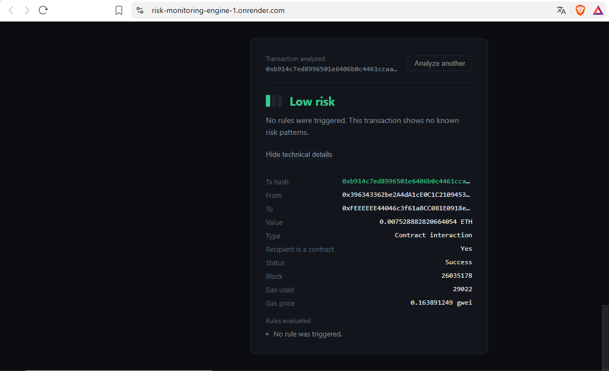

# Risk Monitoring Engine

A configurable rule engine for real-time Ethereum transaction risk monitoring and alerting. Analyze any transaction on-demand by hash, or stream events into it continuously — the same rule engine evaluates both.



📹 [Watch demo video](https://youtu.be/KVdkqj9M1R0)

**Live demo:** https://risk-monitoring-engine-1.onrender.com  
**Backend API:** https://risk-monitoring-engine.onrender.com/docs

## Problem

Manually checking whether an Ethereum transaction looks risky means opening Etherscan, reading raw values, and applying judgment by hand — there's no lightweight way to define "what counts as risky for me" and apply it consistently, in real time, across many transactions.

## Solution

A small backend that lets you define risk rules (`field`, `operator`, `threshold`, `severity`) against any transaction payload, then evaluates transactions against those rules two ways:

1. **On-demand**: submit a transaction hash, the engine fetches it live from Ethereum via RPC, normalizes it, and returns a risk score (0–100) with a plain-language explanation of exactly which rules fired and why.
2. **Streaming**: external services (like the companion [Blockchain Event Pipeline](https://github.com/OnChainForge/blockchain-event-pipeline)) can push transaction events into the engine continuously, generating persisted alerts automatically.

Every score is fully explainable — no black-box model, just transparent, inspectable rules.

## Architecture
                 ┌─────────────────────┐

tx hash ──POST──▶│ FastAPI backend │
│ ┌────────────────┐ │
│ │ web3.py / RPC │ │──▶ Ethereum mainnet (Infura)
│ └────────────────┘ │
│ ┌────────────────┐ │
│ │ Rule engine │ │──▶ SQLite (rules, alerts)
│ └────────────────┘ │
└─────────┬───────────┘
│
risk score + explanation
│
┌─────────▼───────────┐
│ Frontend (HTML/JS) │
└─────────────────────┘


- **Backend**: FastAPI, SQLAlchemy, Pydantic, web3.py
- **Database**: SQLite (WAL mode enabled for concurrent read/write safety)
- **Frontend**: Vanilla HTML/CSS/JS, no framework, dark theme

## Stack

Python · FastAPI · SQLAlchemy · Pydantic · web3.py · SQLite · Vanilla JS

## Running locally

```bash
python3 -m venv venv
source venv/bin/activate
pip install -r requirements.txt
cp .env.example .env  # then fill in ETHEREUM_RPC_URL
uvicorn app.main:app --reload
```

Frontend:
```bash
cd frontend
python3 -m http.server 5500
```

Open `http://localhost:5500`.

## API

| Method | Endpoint | Description |
|---|---|---|
| `POST` | `/rules/` | Create a rule |
| `GET` | `/rules/` | List rules |
| `PATCH` | `/rules/{id}/toggle` | Enable/disable a rule |
| `DELETE` | `/rules/{id}` | Delete a rule |
| `POST` | `/events/` | Submit an event for rule evaluation (streaming mode) |
| `GET` | `/alerts/` | List generated alerts |
| `POST` | `/analyze/{tx_hash}` | Fetch and analyze a real transaction on-demand |

## Technical decisions

- **Explainable scoring over ML**: a transparent rule engine means every score can be traced to exactly which conditions fired — critical for a risk tool where "why" matters as much as "what."
- **SQLite with WAL mode**: chosen for local development on constrained hardware; WAL mode specifically allows reads and writes to happen concurrently, which matters once a background listener is writing while the API is being queried.
- **Two evaluation modes sharing one engine**: on-demand analysis and streaming ingestion both call the same `evaluate` logic, avoiding duplicated risk logic between use cases.

## Challenges & learnings

- Running on Python 3.14 (very new at time of writing) meant some pinned dependency versions lacked precompiled wheels and failed to build from source. Solved by loosening version constraints to pull in releases with `cp314` wheel support instead of downgrading the Python version.
- Early versions used `db.commit()` once per block/batch, which caused long-held write locks that blocked concurrent reads. Fixed by committing more granularly and enabling SQLite's WAL journal mode.

## License

MIT
